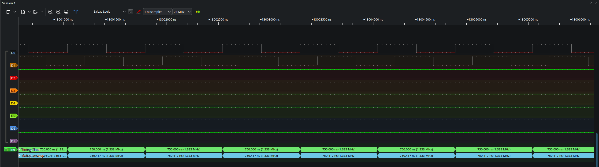

# ATtiny85 Phase Clock Generator

Hardware quadrature clock generator built on the ATtiny85. 

It accepts a 2 pin or 1 pin external crystal input and outputs two 50% duty cycle clock signals (E and Q) shifted by 90 degrees. This output can be used for Motorola 6800 series MPUs and other processors requiring two phase quadrature clocks.

## Clock Ratios & Implementation

| Mode | Division Ratio | Implementation Method | 8 MHz Clock | 12 MHz Crystal | 16 MHz Crystal |
| :--- | :--- | :--- | :--- | :--- | :--- | :--- |
| **Divide-by-8** | F_out = F_clk / 8 | 1.0 MHz | 1.5 MHz | 2.0 MHz |
| **Divide-by-12** | F_out = F_clk / 12 | 0.66 MHz | 1.0 MHz | 1.33 MHz |

## Pinout

| ATtiny85 Pin | Port Pin | Function |
| :--- | :--- | :--- |
| Pin 2 | `PB3` | Crystal Input 1 |
| Pin 3 | `PB4` | Crystal Input 2 |
| Pin 5 | `PB0` | **Q** Clock Output |
| Pin 6 | `PB1` | **E** Clock Output |

## Timing Output

## Repository Structure

    attiny85-phase-shifter/
    ├── assets/                            # Images and timing captures
    │   ├── ide-options.png
    │   └── salae-tiny-16mhz-6809.png
    ├── div-8/                             # r Divide by 8
    │   ├── attiny85-div8.ino
    │   └── main-div8.c
    ├── div-12/                            # Divide by 12
    │   ├── attiny85-div12.ino
    │   └── main-div12.c
    ├── .gitignore
    ├── LICENSE
    └── README.md
