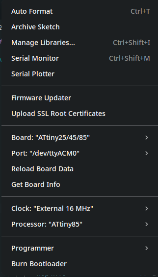

# ATtiny85 Phase Clock Generator

Hardware quadrature clock generator using ATtiny85. It can be used for processors like the Motorola 6809.

## Features
* Generates Q and E phase clock signals
* 90 degree phase shift with 50 percent duty cycle

## Files
* files/main.c: C source code
* files/attiny85-QE-MPU.ino: Arduino sketch
* files/attiny85-QE-MPU.hex: Compiled hex file ready to burn
* pictures/salae-tiny-16mhz-6809.png: PulseView capture output
* pictures/ide-options.png: Arduino IDE setup screen

## Pinout
* Pin 2 (PB3): Crystal 1
* Pin 3 (PB4): Crystal 2
* Pin 5 (PB0): Q clock output
* Pin 6 (PB1): E clock output

## Fuses
Set low fuse to 0xFF for external crystal without clock division.

## Waveform Capture

## IDE Configuration

